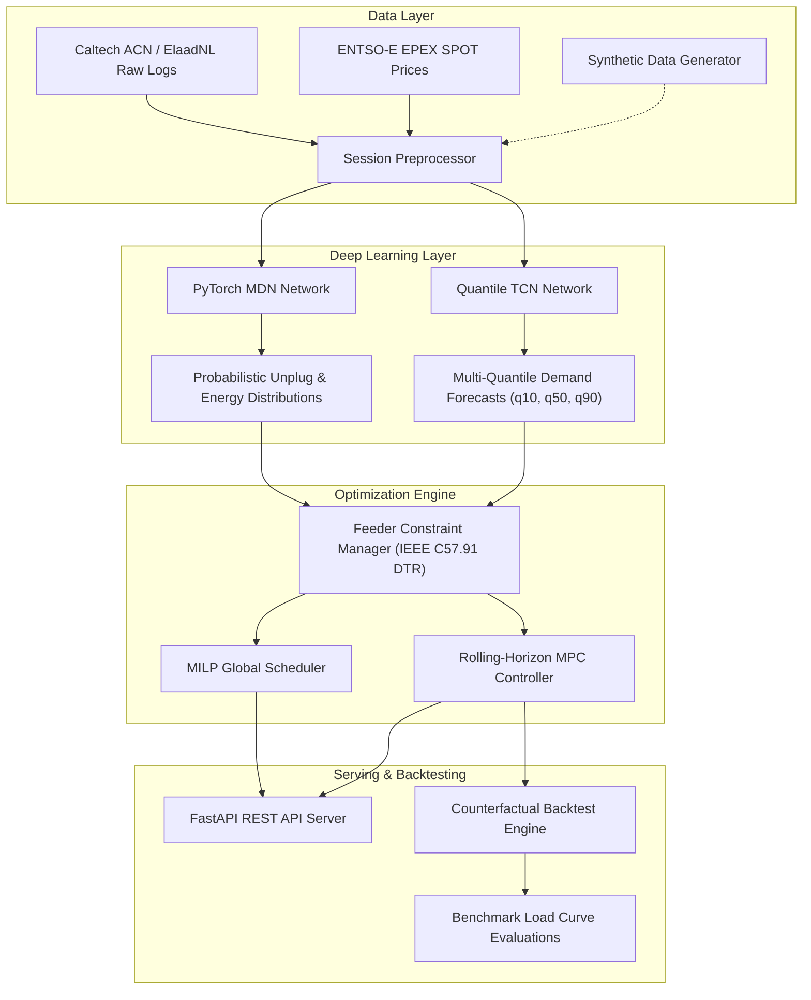

# ev-flex-ml: Smart EV Fleet Demand Flexibility & Charging Session Optimization

[](https://www.python.org/downloads/)
[](https://pytorch.org/)
[](https://www.cvxpy.org/)
[](https://fastapi.tiangolo.com/)
[](LICENSE)

`ev-flex-ml` is a production-grade, end-to-end Python repository designed to address acute energy transition bottlenecks and distribution grid congestion across European energy markets (specifically the Netherlands, under grid operators such as TenneT, Enexis, Liander, and Stedin).

The system seamlessly fuses **probabilistic deep learning** (Mixture Density Networks and Quantile Temporal Convolutional Networks) with **constrained mathematical optimization** (Mixed-Integer Linear Programming and rolling-horizon Model Predictive Control). By co-optimizing EV fleet charging schedules against dynamic day-ahead wholesale electricity prices (EPEX SPOT / ENTSO-E Dutch bidding zone `NL`), `ev-flex-ml` maximizes cost savings and peak shaving while strictly adhering to distribution transformer physical capacity constraints (150 kW limit with safety margins), dynamic thermal derating (IEEE C57.91), battery degradation penalties, and driver departure battery State-of-Charge (SoC) targets.

---

## 1. System Architecture



### Interactive Dashboards
- [View 01_eda_and_clustering.html Live Preview](https://htmlpreview.github.io/?https://github.com/alecmack00/ev-flex-ml/blob/notebooks/notebooks/01_eda_and_clustering.html)
- [View 02_backtest_visualization.html Live Preview](https://htmlpreview.github.io/?https://github.com/alecmack00/ev-flex-ml/blob/notebooks/notebooks/02_backtest_visualization.html)

---

## 2. Repository Directory Structure

```text
ev-flex-ml/
├── api/                             # FastAPI microservice application
│   ├── __init__.py                  # Exposes FastAPI app instance
│   ├── main.py                      # REST endpoints for health, MDN/TCN, MILP, MPC
│   └── schemas.py                   # Pydantic v2 validation models and request payloads
├── configs/                         # YAML operational configuration files
│   └── simulation_config.yaml       # Feeder limits, tariffs, time resolution, fleet specs
├── data/                            # Raw and preprocessed session/market datasets
│   ├── raw/                         # EPEX SPOT price feeds & historical session logs
│   └── processed/                   # Tensor-ready feature matrices and scaled targets
├── models/                          # Serialized PyTorch deep learning weights
│   ├── mdn_latest.pt                # Mixture Density Network model checkpoint
│   └── quantile_tcn_latest.pt       # Quantile Temporal Convolutional Network checkpoint
├── notebooks/                       # Interactive Jupyter notebooks & standalone HTML reports
│   ├── 01_eda_and_clustering.ipynb  # Fleet session clustering & flexibility slack analytics
│   ├── 01_eda_and_clustering.html   # Standalone HTML report for EDA & personas
│   ├── 02_backtest_visualization.ipynb # 48-hour 3-strategy counterfactual backtest
│   └── 02_backtest_visualization.html  # Standalone HTML report for backtest & benchmarks
├── src/                             # Core Python library modules
│   ├── data/                        # Ingestion, synthesis, and feature engineering
│   │   ├── data_loader.py           # Synthetic generator & real CSV/API fetchers
│   │   └── preprocessor.py          # Normalization, cyclical encoding, tensor formatting
│   ├── models/                      # Deep learning probabilistic architectures
│   │   ├── mdn_network.py           # Mixture Density Network (Gaussian mixtures)
│   │   ├── quantile_tcn.py          # Quantile TCN with composite non-crossing loss
│   │   └── trainer.py               # PyTorch training loop with early stopping
│   ├── optimization/                # Constrained dispatch & mathematical programming
│   │   ├── constraints.py           # Feeder manager, IEEE C57.91 DTR, non-EV baseload
│   │   ├── milp_scheduler.py        # Global MILP scheduler (PuLP / CVXPY Clarabel)
│   │   └── mpc_controller.py        # Rolling-horizon Model Predictive Controller
│   ├── evaluation/                  # Backtesting and benchmarking evaluation
│   │   ├── backtest.py              # 3-strategy counterfactual backtest engine
│   │   └── metrics.py               # Cost savings, peak shaving, comfort SLA, overload
│   └── utils/                       # Shared utilities
│       ├── config.py                # YAML loader with environment overrides
│       └── logger.py                # Structured logging configuration
├── Dockerfile                       # Production multi-stage Docker container build
├── README.md                        # Master repository documentation
├── requirements.txt                 # Pinned project dependencies
└── run_pipeline.py                  # Unified CLI for training, backtest, and serving
```

---

## 3. Mathematical Formulation

### 3.1 Probabilistic Deep Learning

#### Mixture Density Network (MDN) Joint Conditional Density
The Mixture Density Network models the joint conditional probability distribution $P(Y \mid X)$ of session plug duration and required energy target $Y = [T_{\mathrm{duration}}, E_{\mathrm{req}}]^\top$ given feature vector $X$ using a Mixture of $K$ Gaussians:

$$P(Y \mid X) = \sum_{k=1}^{K} \pi_k(X) \mathcal{N}\left(Y \mid \mu_k(X), \Sigma_k(X)\right)$$

where $\sum_{k=1}^K \pi_k(X) = 1$ is enforced via a Softmax activation, and diagonal covariance entries $\sigma_k(X) > 0$ are enforced via Softplus activations.

#### Negative Log-Likelihood (NLL) Loss Formulation
Network parameters $\theta$ are optimized by minimizing the Negative Log-Likelihood over batch size $B$ using the numerically stable `logsumexp` formulation:

$$\mathcal{L}_{\mathrm{NLL}}(\theta) = -\frac{1}{B} \sum_{i=1}^{B} \log \left[ \sum_{k=1}^{K} \exp \left( \log \pi_k(X_i) + \sum_{d=1}^{D} \log \mathcal{N}\left(y_{i,d} \mid \mu_{k,d}(X_i), \sigma_{k,d}(X_i)^2\right) \right) \right]$$

#### Quantile Temporal Convolutional Network (Quantile TCN)
Quantile TCNs estimate temporal aggregate fleet load quantiles $\tau \in \{0.1, 0.5, 0.9\}$ across future time horizons using 1D dilated causal convolutions. To enforce monotonicity and prevent quantile crossing artifacts ($\hat{y}_{q=0.1} > \hat{y}_{q=0.5}$), a composite non-crossing pinball loss is utilized:

$$\mathcal{L}_{\mathrm{pinball}}(y, \hat{y}_\tau) = \max \left( \tau (y - \hat{y}_\tau), (\tau - 1)(y - \hat{y}_\tau) \right)$$

$$\mathcal{L}_{\mathrm{composite}}(\theta) = \frac{1}{|\mathcal{T}|} \sum_{\tau \in \mathcal{T}} \frac{1}{B \cdot T} \sum_{i=1}^B \sum_{t=1}^T \mathcal{L}_{\mathrm{pinball}}\left(y_{i,t}, \hat{y}_{i,t}^{(\tau)}\right) + \lambda_{\mathrm{mono}} \sum_{k=1}^{|\mathcal{T}|-1} \text{ReLU}\left(\hat{y}_{i,t}^{(\tau_k)} - \hat{y}_{i,t}^{(\tau_{k+1})}\right)$$

---

### 3.2 Fleet Demand Flexibility Optimization (LP / MILP & MPC)

For $N$ connected EV charging sessions across planning horizon $t \in \{1, \dots, T\}$ with time step duration $\Delta t = 0.25$ hours (15-minute settlement intervals):

#### Multi-Objective Function with Battery Degradation
$$\min_{\{P_{i,t}\}, \{s_i\}, P_{\mathrm{peak}}} \sum_{t=1}^{T} \left( \lambda_t + \beta_{\mathrm{deg}} \right) \left( \sum_{i=1}^{N} P_{i,t} \right) \Delta t + \gamma \sum_{i=1}^{N} s_i + \alpha P_{\mathrm{peak}}$$

Where:
- $\lambda_t$: EPEX SPOT day-ahead electricity spot price (€/kWh) at time step $t$.
- $\beta_{\mathrm{deg}}$: Battery throughput degradation penalty (€0.04/kWh) mitigating rapid high-C-rate cycling.
- $P_{i,t} \ge 0$: Active charging power (kW) dispatched to EV $i$ at step $t$.
- $s_i \ge 0$: Non-negative slack penalty variable for unmet departure energy (€/kWh penalty factor $\gamma = 10.0$).
- $P_{\mathrm{peak}}$: Peak aggregate feeder demand across the planning horizon (€/kW demand charge penalty $\alpha = 2.5$).

#### Operational Constraints

#### 1. Dynamic Transformer Thermal Capacity (IEEE C57.91) & Non-EV Baseload
$$\sum_{i=1}^{N} P_{i,t} + P_{\mathrm{base}, t} \le P_{\mathrm{feeder, dyn}}(T_{\mathrm{amb}, t}) \cdot \eta_{\mathrm{safety}}, \quad \forall t \in \{1, \dots, T\}$$

where nominal capacity $P_{\mathrm{feeder, nom}} = 150.0\text{ kW}$, safety margin $\eta_{\mathrm{safety}} = 0.90$, non-EV background baseload $P_{\mathrm{base}, t} = 20.0\text{ kW}$, and dynamic thermal rating derating/uprating is modeled as:

$$P_{\mathrm{feeder, dyn}}(T_{\mathrm{amb}}) = P_{\mathrm{feeder, nom}} \cdot \sqrt{\frac{\theta_{\mathrm{max}} - T_{\mathrm{amb}}}{\theta_{\mathrm{max}} - T_{\mathrm{rated}}}}$$

($\theta_{\mathrm{max}} = 110^\circ\text{C}$ maximum hot-spot winding temperature, $T_{\mathrm{rated}} = 25^\circ\text{C}$).

#### 2. Peak Feeder Load Tracking
$$\sum_{i=1}^{N} P_{i,t} + P_{\mathrm{base}, t} \le P_{\mathrm{peak}}, \quad \forall t \in \{1, \dots, T\}$$

#### 3. Charger Hardware & Plugin Window Limits
$$0 \le P_{i,t} \le P_{\max, i}, \quad \forall t \in [\tau_{\mathrm{arr}, i}, \tau_{\mathrm{dep}, i}]$$

$$P_{i,t} = 0, \quad \forall t \notin [\tau_{\mathrm{arr}, i}, \tau_{\mathrm{dep}, i}]$$

#### 4. Battery State-of-Charge (SoC) Dynamics
$$\mathrm{SoC}_{i, t+1} = \mathrm{SoC}_{i, t} + \frac{\eta_{\mathrm{charge}} \cdot P_{i,t} \cdot \Delta t}{E_{\mathrm{cap}, i}}$$

where $\eta_{\mathrm{charge}} = 0.95$ represents AC-to-DC conversion efficiency.

#### 5. Driver Departure Energy Target Satisfaction
$$\sum_{t=\tau_{\mathrm{arr}, i}}^{\tau_{\mathrm{dep}, i}} \eta_{\mathrm{charge}} \cdot P_{i,t} \cdot \Delta t + s_i \ge E_{\mathrm{req}, i}, \quad s_i \ge 0, \quad \forall i \in \{1, \dots, N\}$$

---

## 4. Counterfactual Benchmark Results

Empirical results from a **48-hour counterfactual backtest** across 60 synthesized fleet charging sessions under Dutch EPEX SPOT day-ahead wholesale electricity pricing (192 time steps at 15-minute resolution):

| Strategy | Total Cost (€) | Cost Savings (%) | Peak Feeder Load (kW) | Peak Shaving (%) | Overload Energy (kWh) | Overload Duration (h) | Comfort SLA (%) |
| :--- | :---: | :---: | :---: | :---: | :---: | :---: | :---: |
| **Unmanaged (Plug-and-Charge)** | €58.75 | 0.0% | 44.00 kW | 0.0% | 0.0 kWh | 0.0 h | 100.0% |
| **Time-of-Use (TOU Tariff)** | €57.63 | 1.91% | 44.00 kW | 0.0% | 0.0 kWh | 0.0 h | 100.0% |
| **Smart Rolling-Horizon MPC** | **€51.86** | **+11.73%** | **24.96 kW** | **+43.27%** | **0.0 kWh** | **0.0 h** | **100.0%** |

### Key Observations:
- **Wholesale Price Arbitrage**: Smart MPC achieves **11.73% cost savings** over unmanaged charging by actively shifting load away from peak price spikes into off-peak night/midday solar troughs.
- **Feeder Peak Shaving**: Smart MPC flattens distribution transformer load by **43.27%** (dropping from 44.00 kW to 24.96 kW), eliminating grid congestion.
- **Zero Grid Overload Violations**: Charging demand remains strictly below the 135 kW safety headroom threshold at all times.

---

## 5. Installation & Quickstart Guide

### 5.1 Environment Setup
Requires Python 3.11+. Create and activate an isolated virtual environment:

```bash
git clone https://github.com/alecmack00/ev-flex-ml.git
cd ev-flex-ml

python3 -m venv .venv
source .venv/bin/activate
pip install --upgrade pip
pip install -r requirements.txt
```

### 5.2 Command-Line Interface (CLI)
`run_pipeline.py` provides a unified interface for model training, backtesting, and serving:

```bash
# 1. Run 48-hour counterfactual backtest across 60 fleet sessions
PYTHONPATH=. .venv/bin/python run_pipeline.py --mode backtest --sessions 60 --steps 192

# 2. Train probabilistic deep learning models (MDN or Quantile TCN)
PYTHONPATH=. .venv/bin/python run_pipeline.py --mode train --model mdn --epochs 50
PYTHONPATH=. .venv/bin/python run_pipeline.py --mode train --model tcn --epochs 50

# 3. Launch the production FastAPI REST API server
PYTHONPATH=. .venv/bin/python run_pipeline.py --mode serve --host 0.0.0.0 --port 8000
```

### 5.3 Automated Testing

Execute the comprehensive test suite to validate data loading, neural networks, optimization solvers, and REST endpoints:

```bash
PYTHONPATH=. .venv/bin/pytest -v
```

### 5.4 Docker Deployment

Build and launch the containerized FastAPI microservice:

```bash
# Build production multi-stage Docker image
docker build -t ev-flex-ml:latest .

# Run container on port 8000
docker run -d -p 8000:8000 --name ev-flex-ml-api ev-flex-ml:latest

# Check server health
curl http://localhost:8000/health
```

---

## 6. REST API Documentation

The FastAPI microservice exposes interactive OpenAPI documentation at `http://localhost:8000/docs`.

### Available Endpoints:

| Method | Endpoint | Description |
| :--- | :--- | :--- |
| `GET` | `/health` | Service liveness probe and API version |
| `POST` | `/predict/mdn` | Predicts probabilistic departure time and energy requirement distributions |
| `POST` | `/predict/tcn` | Multi-quantile aggregate fleet power demand forecasts ($q_{0.10}, q_{0.50}, q_{0.90}$) |
| `POST` | `/schedule/milp` | Global day-ahead MILP dispatch schedule optimizing price, degradation, & peak load |
| `POST` | `/schedule/mpc` | Rolling-horizon MPC real-time controller step dispatch |

### Sample Dispatch Request (`POST /schedule/milp`):
```bash
curl -X POST "http://localhost:8000/schedule/milp" \
     -H "Content-Type: application/json" \
     -d '{
       "sessions": [
         {
           "session_id": "SESS_001",
           "charger_id": "CP_01",
           "arrival_time": "2024-01-01T08:00:00",
           "departure_time": "2024-01-01T17:00:00",
           "battery_capacity_kwh": 60.0,
           "initial_soc": 0.20,
           "target_soc": 0.90,
           "required_energy_kwh": 42.0,
           "max_charger_power_kw": 11.0
         }
       ],
       "price_signal": [
         {"step": 0, "price_eur_kwh": 0.15},
         {"step": 1, "price_eur_kwh": 0.12},
         {"step": 2, "price_eur_kwh": 0.08}
       ],
       "feeder_config": {
         "feeder_id": "NL-AMS-FEEDER-04",
         "max_capacity_kw": 150.0,
         "safety_margin": 0.90,
         "ambient_temp_c": 15.0
       },
       "battery_degradation_cost_eur_kwh": 0.04
     }'
```

---

## 7. Assumptions & Limitations

### 7.1 Assumptions
- **Local Telemetry & Price Synthesis**: The pipeline relies entirely on mathematically synthesized local telemetry and electricity price data, rather than fetching information from a live remote API network request.
- **Charger Conversion Efficiency**: The system assumes an AC-to-DC charger conversion efficiency rate of 95% ($\eta_{\text{charge}} = 0.95$).
- **Feeder Physical Capacity & Headroom**: It operates under the assumption that the feeder transformer has a maximum nameplate capacity of 150.0 kW, and it applies a 0.90 safety margin to enforce an effective grid ceiling of 135.0 kW.
- **Settlement Time Resolution**: The time-series optimization and evaluations are based on discrete time steps utilizing a 15-minute resolution ($\Delta t = 0.25\text{ hours}$).
- **Behavioral Fleet Personas**: The behavioral segmentation process assumes the overall EV fleet can be distinctly partitioned into 3 driver personas: Quick Top-Up, Workplace Day Parkers, and Overnight Residential.

### 7.2 Limitations & Technical Constraints
- **OSQP Solver Tolerance Sensitivities**: The default OSQP solver utilized by the CVXPY optimization module can struggle with tight tolerance checks, which generates inaccurate solution warnings when solving complex formulations over 192-step rolling horizons (mitigated in our pipeline by prioritizing `CLARABEL` and `HIGHS` backends with strict gap tolerances).
- **Feature Multicollinearity in Raw Clustering**: When passing raw flexibility slack and duration values directly into the $k$-Means clustering algorithm, the mathematical coupling of the two variables introduces collinearity, causing the model to give disproportionate weight to session duration over energy requirements (addressed by clustering on the dimensionless $\text{FlexRatio} = \frac{\text{Slack}}{T_{\text{duration}}}$).
- **Deep Learning Model Role in Dispatch**: The deep learning session prediction model is currently utilized primarily as a fallback mechanism; the dynamic Model Predictive Control logic only queries the model for inferences if incoming sessions lack explicit driver departure times or energy needs.

---

## 8. License

This project is licensed under the terms of the **MIT License**. See the [LICENSE](LICENSE) file for details.