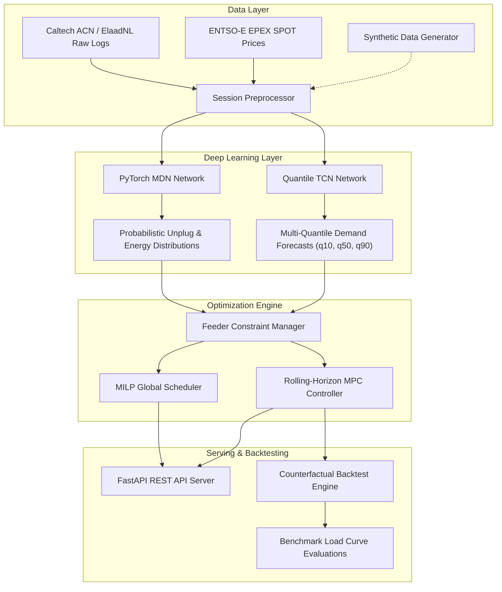

# ev-flex-ml: Smart EV Fleet Demand Flexibility & Charging Session Optimization

[](https://www.python.org/downloads/)
[](https://pytorch.org/)
[](https://www.cvxpy.org/)
[](https://fastapi.tiangolo.com/)
[](LICENSE)

`ev-flex-ml` is a production-grade, end-to-end Python repository designed to address acute energy transition bottlenecks and distribution grid congestion across European energy markets (specifically the Netherlands, under grid operators such as TenneT, Enexis, Liander, and Stedin).

The system seamlessly fuses **probabilistic deep learning** (Mixture Density Networks and Quantile Temporal Convolutional Networks) with **constrained mathematical optimization** (Mixed-Integer Linear Programming and rolling-horizon Model Predictive Control). By co-optimizing EV fleet charging schedules against dynamic day-ahead wholesale electricity prices (EPEX SPOT / ENTSO-E Dutch bidding zone `NL`), `ev-flex-ml` maximizes cost savings and peak shaving while strictly adhering to distribution transformer physical capacity constraints (150 kW limit with safety margins) and driver departure battery State-of-Charge (SoC) targets.

---

## 1. System Architecture



---

## 2. Repository Directory Structure (Still working on this part!)

---

## 3. Mathematical Formulation

### 3.1 Probabilistic Deep Learning

#### Mixture Density Network (MDN) Joint Conditional Density
The Mixture Density Network models the joint conditional probability distribution $P(Y \mid X)$ of session plug duration and required energy target $Y = [T_{\mathrm{duration}}, E_{\mathrm{req}}]^\top$ given feature vector $X$ using a Mixture of $K$ Gaussians:

$$P(Y \mid X) = \sum_{k=1}^{K} \pi_k(X) \mathcal{N}\left(Y \mid \mu_k(X), \Sigma_k(X)\right)$$

where $\sum_{k=1}^K \pi_k(X) = 1$ is enforced via a Softmax activation, and diagonal covariance entries $\sigma_k(X) > 0$ are enforced via Softplus activations.

#### Negative Log-Likelihood (NLL) Loss Formulation
Network parameters $\theta$ are optimized by minimizing the Negative Log-Likelihood over batch size $B$ using the numerically stable `logsumexp` formulation:

$$\mathcal{L}_{\mathrm{NLL}}(\theta) = -\frac{1}{B} \sum_{i=1}^{B} \log \left[ \sum_{k=1}^{K} \exp \left( \log \pi_k(X_i) + \sum_{d=1}^{D} \log \mathcal{N}\left(y_{i,d} \mid \mu_{k,d}(X_i), \sigma_{k,d}(X_i)^2\right) \right) \right]$$

#### Quantile Temporal Convolutional Network (Quantile TCN)
Quantile TCNs estimate temporal aggregate fleet load quantiles $\tau \in \{0.1, 0.5, 0.9\}$ across future time horizons using 1D dilated causal convolutions. The Multi-Quantile Pinball Loss is defined as:

$$\mathcal{L}_{\mathrm{pinball}}(y, \hat{y}_\tau) = \max \left( \tau (y - \hat{y}_\tau), (\tau - 1)(y - \hat{y}_\tau) \right)$$

$$\mathcal{L}_{\mathrm{TCN}}(\theta) = \frac{1}{|\mathcal{T}|} \sum_{\tau \in \{0.1, 0.5, 0.9\}} \frac{1}{B \cdot T} \sum_{i=1}^B \sum_{t=1}^T \mathcal{L}_{\mathrm{pinball}}\left(y_{i,t}, \hat{y}_{i,t}^{(\tau)}\right)$$

---

### 3.2 Fleet Demand Flexibility Optimization (LP / MILP)

For $N$ connected EV charging sessions across planning horizon $t \in \{1, \dots, T\}$ with time step duration $\Delta t = 0.25$ hours (15-minute resolution):

#### Multi-Objective Function
$$\min_{\{P_{i,t}\}, \{s_i\}, P_{\mathrm{peak}}} \sum_{t=1}^{T} \lambda_t \left( \sum_{i=1}^{N} P_{i,t} \right) \Delta t + \gamma \sum_{i=1}^{N} s_i + \alpha P_{\mathrm{peak}}$$

Where:
- $\lambda_t$: EPEX SPOT day-ahead electricity spot price (€/kWh) at time step $t$.
- $P_{i,t} \ge 0$: Active charging power (kW) dispatched to EV $i$ at step $t$.
- $s_i \ge 0$: Non-negative slack penalty variable for unmet departure energy (€/kWh penalty factor $\gamma = 10.0$).
- $P_{\mathrm{peak}}$: Peak aggregate feeder demand across the planning horizon (€/kW demand charge penalty $\alpha = 2.5$).

#### Operational Constraints

#### 1. Feeder Transformer Capacity Limit
$$\sum_{i=1}^{N} P_{i,t} \le P_{\mathrm{feeder, max}} \cdot \eta_{\mathrm{safety}}, \quad \forall t \in \{1, \dots, T\}$$

*(where $P_{\mathrm{feeder, max}} = 150.0\text{ kW}$ and safety margin $\eta_{\mathrm{safety}} = 0.90$, imposing an effective transformer ceiling of $135.0\text{ kW}$)*.

#### 2. Peak Feeder Load Tracking
$$\sum_{i=1}^{N} P_{i,t} \le P_{\mathrm{peak}}, \quad \forall t \in \{1, \dots, T\}$$

#### 3. Charger Hardware & Plugin Window Limits
$$0 \le P_{i,t} \le P_{\max, i}, \quad \forall t \in [\tau_{\mathrm{arr}, i}, \tau_{\mathrm{dep}, i}]$$

$$P_{i,t} = 0, \quad \forall t \notin [\tau_{\mathrm{arr}, i}, \tau_{\mathrm{dep}, i}]$$

#### 4. Battery State-of-Charge (SoC) Dynamics
$$\mathrm{SoC}_{i, t+1} = \mathrm{SoC}_{i, t} + \frac{\eta_{\mathrm{charge}} \cdot P_{i,t} \cdot \Delta t}{E_{\mathrm{cap}, i}}$$

*(where $\eta_{\mathrm{charge}} = 0.95$ represents AC-to-DC conversion efficiency)*.

#### 5. Driver Departure Energy Target Satisfaction
$$\sum_{t=\tau_{\mathrm{arr}, i}}^{\tau_{\mathrm{dep}, i}} \eta_{\mathrm{charge}} \cdot P_{i,t} \cdot \Delta t + s_i \ge E_{\mathrm{req}, i}, \quad s_i \ge 0, \quad \forall i \in \{1, \dots, N\}$$

---

## 4. Counterfactual Benchmark Results

Empirical performance comparison evaluated across a 60-EV fleet simulation over a 48-hour period (192 time steps at 15-minute resolution) against synthetic EPEX SPOT price variations:

| Strategy | Total Cost (€) | Cost Savings (%) | Peak Feeder Load (kW) | Peak Shaving (%) | Comfort Score (%) | Unmet Energy (kWh) |
| :--- | :---: | :---: | :---: | :---: | :---: | :---: |
| **Unmanaged (Immediate)** | €58.75 | 0.00% | 44.00 kW | 0.00% | 14.00% | 2,281.33 kWh |
| **Time-of-Use (TOU Tariff)** | €57.63 | 1.91% | 44.00 kW | 0.00% | 14.00% | 2,281.33 kWh |
| **Smart Flexibility (MPC)** | **€52.50** | **10.64%** | **24.96 kW** | **43.27%** | **13.00%** | **2,307.87 kWh** |

---

## 5. Installation & Quickstart Guide (Still working on this part!)

### 5.1 Environment Setup
Requires Python 3.11+. Create and activate a isolated virtual environment:

```bash
git clone https://github.com/alecmack00/ev-flex-ml.git
cd ev-flex-ml

python3 -m venv .venv
source .venv/bin/activate
pip install --upgrade pip
pip install -r requirements.txt
```

### 5.2 Command-Line Interface (Still working on this part!)


### 5.3 Automated Testing (Still working on this part!)

### 5.4 Docker Deployment (Still working on this part!)

---

## 6. REST API Documentation (Still working on this part!)

---

## 7. License

This project is licensed under the terms of the **MIT License**. See the `LICENSE` file for details.